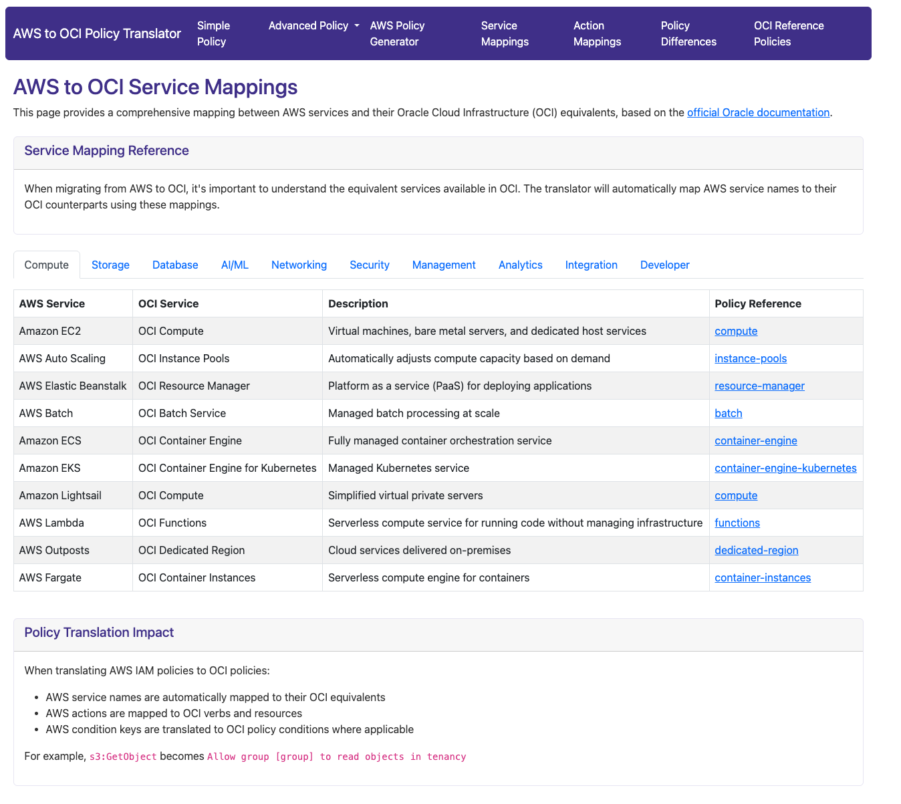
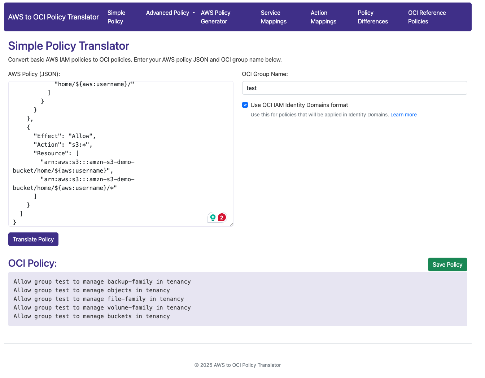
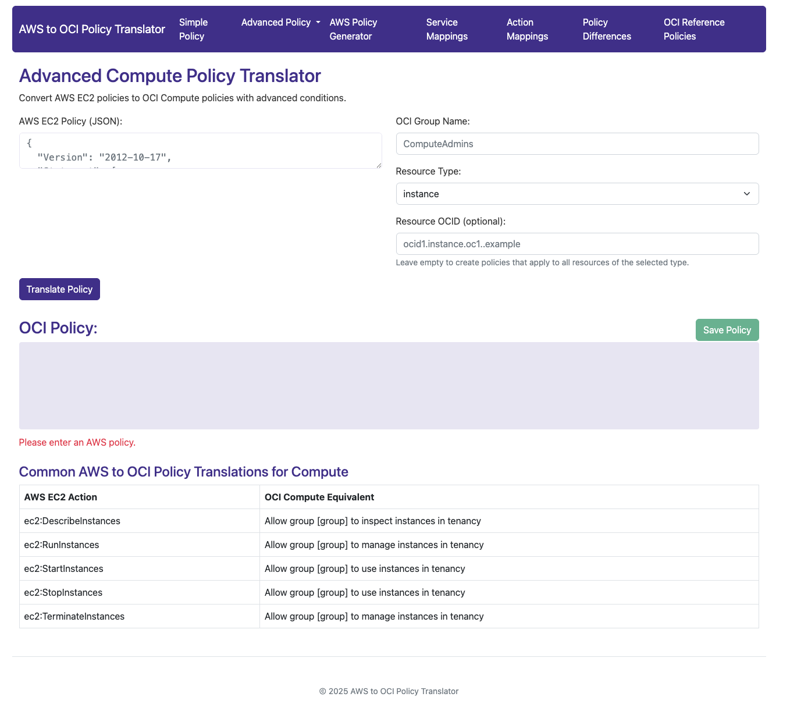
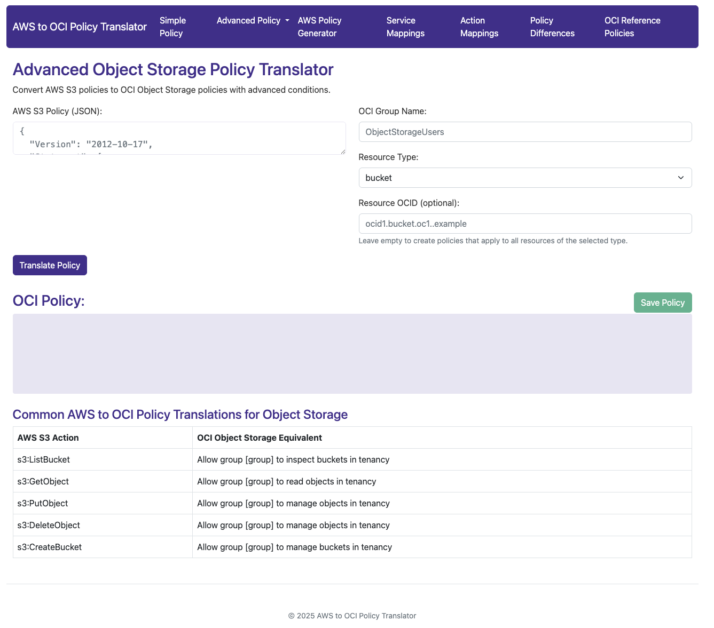
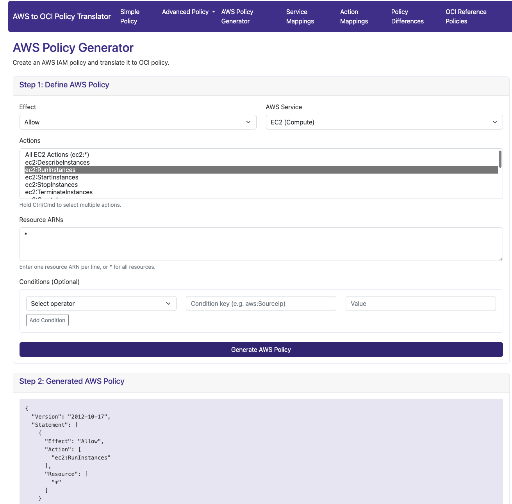
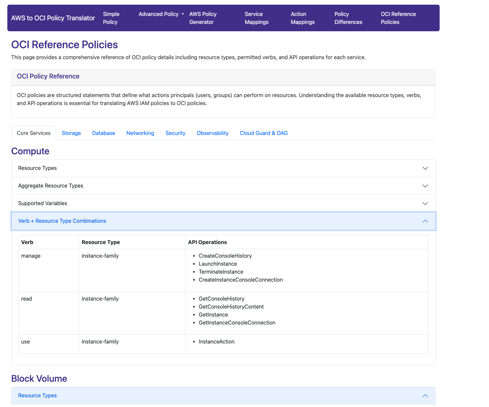
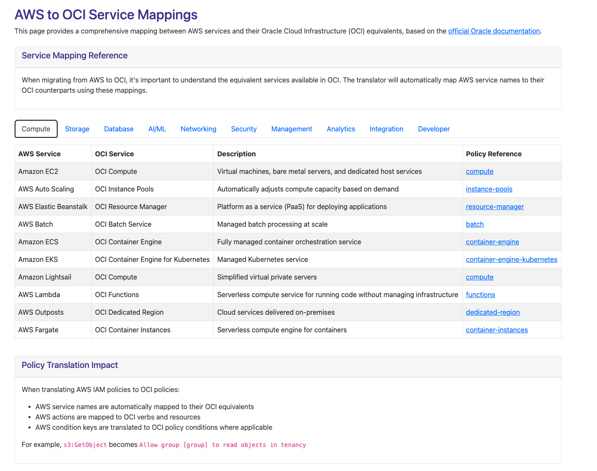
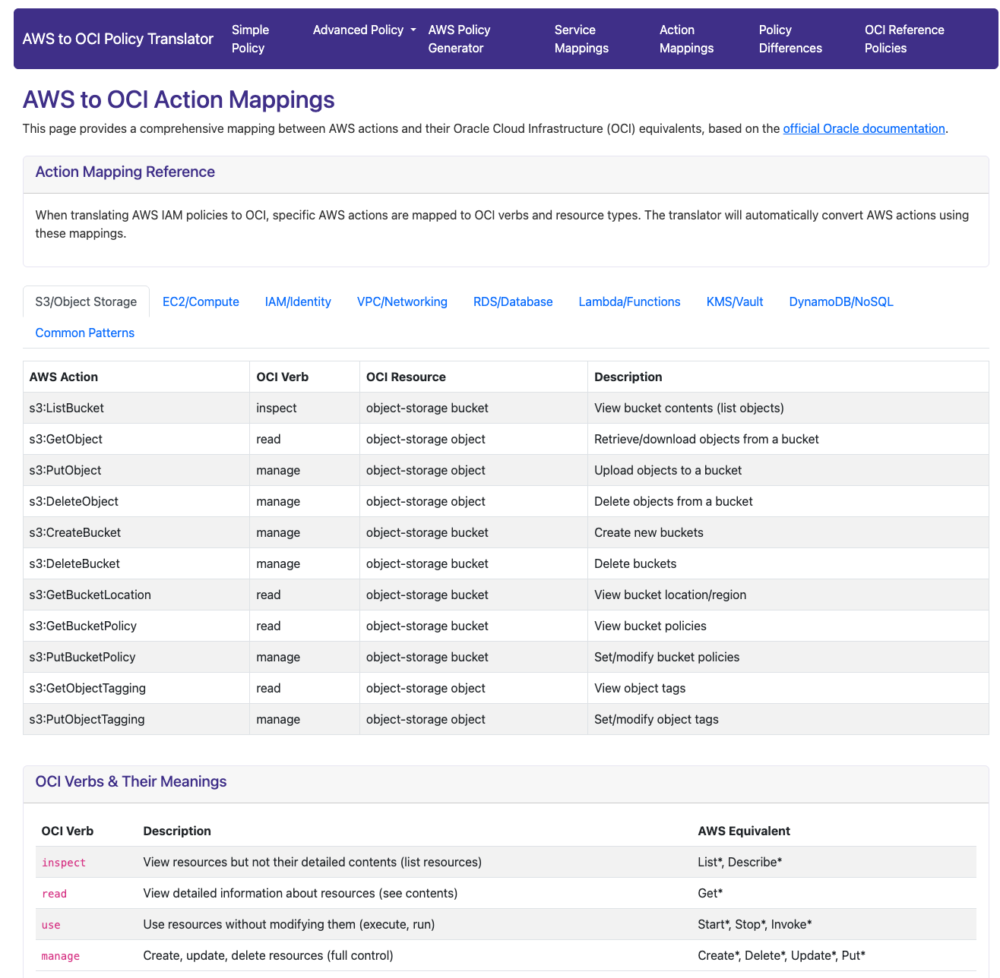

# AWS to OCI Policy Translator

A web application that translates AWS IAM policies to Oracle Cloud Infrastructure (OCI) policies with support for various service-specific policy types.
This is not an Oracle Corporation Software!!It was created to help and better understand OCI Policies and how to create them when you are moving from AWS. For most of the policies I tested manually,
the response was the one from Oracle Documentation. For advanced ones, if there are errors, or the policy is not correct, please provide the correct one, and I will update the code. 

## Features

- Simple policy translation for general AWS to OCI policy conversion
- Advanced service-specific policy translation:
  - IAM policies
  - Compute policies
  - Object Storage policies
- Interactive AWS policy generator with support for common AWS services
- Comprehensive OCI policy reference documentation and examples
- OCI condition patterns with examples for simulating AWS "Deny" statements
- Policy validation to ensure correct syntax
- Save policies as text files
- Up-to-date service mappings between AWS and OCI
- Web scraper to keep OCI policy reference information current
- Database API operations reference for granular permission control

## Prerequisites for Ubuntu

- Python 3.8 or higher
- pip (Python package manager)
- Git (optional, for cloning the repository)

## Installation on Ubuntu

### Automatic Installation

The easiest way to install and run the application is by using the provided installation script:

```bash
# Make the script executable
chmod +x install_ubuntu.sh

# Run the installation script
./install_ubuntu.sh
```

This script will:
1. Update your system packages
2. Install Python, pip, and required dependencies
3. Create a virtual environment
4. Install required Python packages
5. Set up and run the application

### Manual Installation

If you prefer to install the application manually, follow these steps:

1. Update your system packages:
   ```bash
   sudo apt update
   sudo apt upgrade -y
   ```

2. Install Python, pip, and other dependencies:
   ```bash
   sudo apt install -y python3 python3-pip python3-venv
   ```

3. Clone the repository (if you haven't already):
   ```bash
   git clone https://github.com/your-repo/aws2ocipolicy.git
   cd aws2ocipolicy
   ```

4. Create a virtual environment and activate it:
   ```bash
   python3 -m venv venv
   source venv/bin/activate
   ```

5. Install required Python packages:
   ```bash
   pip install -r requirements.txt
   ```

   If the requirements.txt file doesn't exist, install the necessary packages:
   ```bash
   pip install flask requests beautifulsoup4
   ```

6. Run the application:
   ```bash
   python app.py
   ```

## Running the Application

After installation, the application will be available at:
```
http://localhost:5001
```

To run the application in production, you should use a WSGI server like Gunicorn:

```bash
# Install Gunicorn (if not already installed)
pip install gunicorn

# Run with Gunicorn
gunicorn -w 4 -b 0.0.0.0:5001 app:app
```

## Using the Application

1. **Simple Policy Translation**:
   - Navigate to the "Simple Policy" page
   - Enter your AWS IAM policy in JSON format
   - Specify the OCI group name
   - Click "Translate Policy"
   - Review the generated OCI policy
   - Use the "Save Policy" button to download the policy as a text file

2. **Advanced Policy Translation**:
   - Select the appropriate service type from the Advanced Policy dropdown menu
   - Enter your AWS service-specific policy
   - Configure the required OCI parameters
   - Click "Translate Policy"
   - Review and save the generated policy

3. **OCI Reference Policies**:
   - Navigate to the "OCI Reference Policies" page to browse comprehensive policy documentation
   - Use the tabs to navigate between different service categories
   - Expand sections to view details about resource types, verbs, and API operations
   - Click "Update Policy Reference Data" to refresh the data from OCI documentation

## Screenshots

### Main Navigation Menu

*The main navigation bar showing all available tools and reference sections*

### Simple Policy Translation

*The simple policy translation interface where users can input AWS policies and get OCI equivalents*

### Advanced Policy Translation - Compute

*Specialized interface for translating AWS EC2 policies to OCI Compute policies*

### Advanced Policy Translation - Object Storage

*Interface for translating AWS S3 policies to OCI Object Storage policies*

### AWS Policy Generator

*Interactive AWS policy builder with automatic OCI translation*

### OCI Reference Policies

*Comprehensive documentation of OCI policy syntax, resource types and examples*

### Service Mappings

*Mapping between AWS services and their OCI equivalents*

### OCI Policy Templates

*Pre-defined OCI policy templates for common administrator roles*

> **Note:** Replace these screenshot placeholders with actual screenshots of your running application. The screenshots directory should be created in the root of your project.

## Troubleshooting

- If you encounter any dependency issues, ensure that all required packages are installed:
  ```bash
  pip install flask requests beautifulsoup4
  ```

- If the policy reference parser fails, check your internet connection and try again. The parser needs to access OCI documentation online.

- For any issues with the application, check the console output for error messages.

## Resources Used for Policy Builder

The AWS Policy Generator functionality utilizes the following resources:

- **aws-policy-generator** - Python library for programmatically building AWS IAM policies
- **awspolicy** - Python library for parsing and analyzing AWS IAM policies
- **AWS IAM Documentation** - Reference for AWS IAM policy structure and syntax
- **OCI IAM Documentation** - Reference for OCI policy structure and syntax
- **Bootstrap 5** - Front-end framework for the web interface
- **Flask** - Python web framework for the backend application
- **jQuery** - JavaScript library for DOM manipulation and AJAX requests

## License

AWS to OCI Policy Translator is licensed under the following custom license:

### AWS to OCI Policy Translator License

1. **Permission to Use and Modify**:
   - You are granted a non-exclusive, worldwide, royalty-free license to use, copy, modify, and distribute this software for personal, non-commercial, or internal business purposes.
   - You may create and distribute derivative works based on this software.

2. **Restrictions**:
   - You may NOT sell, sublicense, or commercially distribute this software or any derivative works based on this software without explicit permission from the original author.
   - This license explicitly prohibits reselling this software or offering it as a paid service without prior written consent.

3. **Attribution**:
   - Any distribution of this software or derivative works must include attribution to the original authors and a link to the original repository.

4. **No Warranty**:
   - This software is provided "AS IS" without warranty of any kind, express or implied.
   - The authors or copyright holders shall not be liable for any claim, damages, or other liability arising from the use of the software.

5. **Termination**:
   - This license automatically terminates if you violate any of its terms.

By using this software, you agree to the terms of this license.
